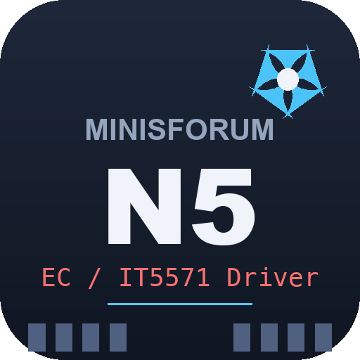
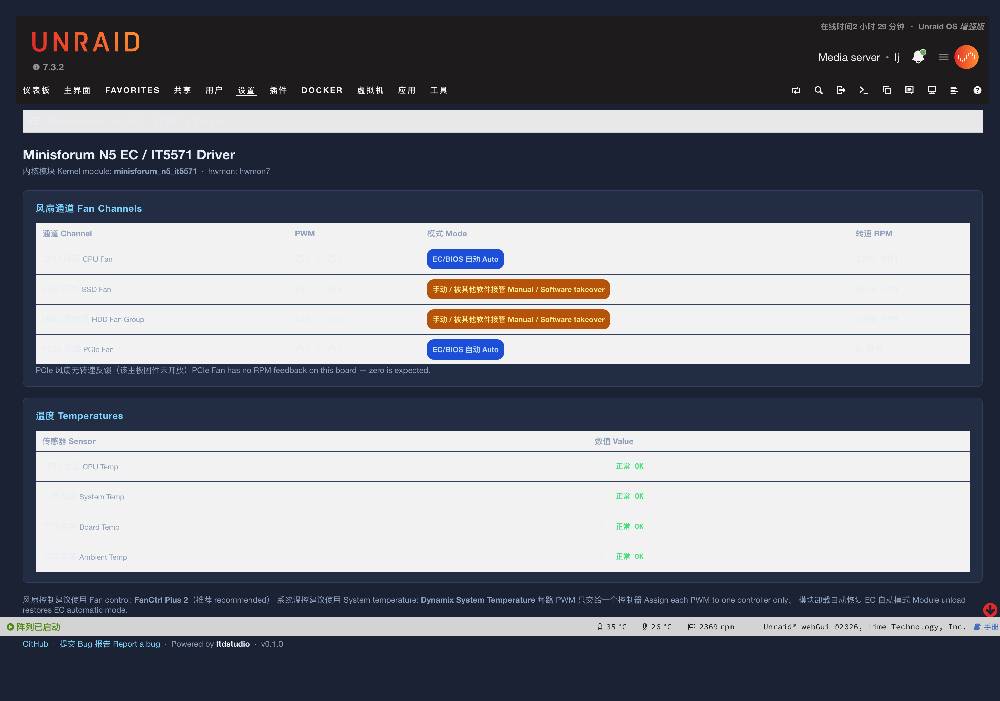
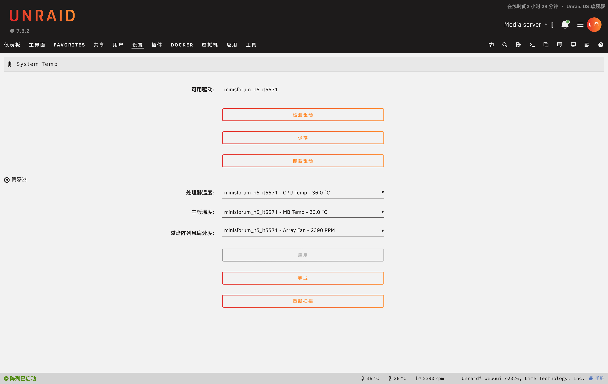
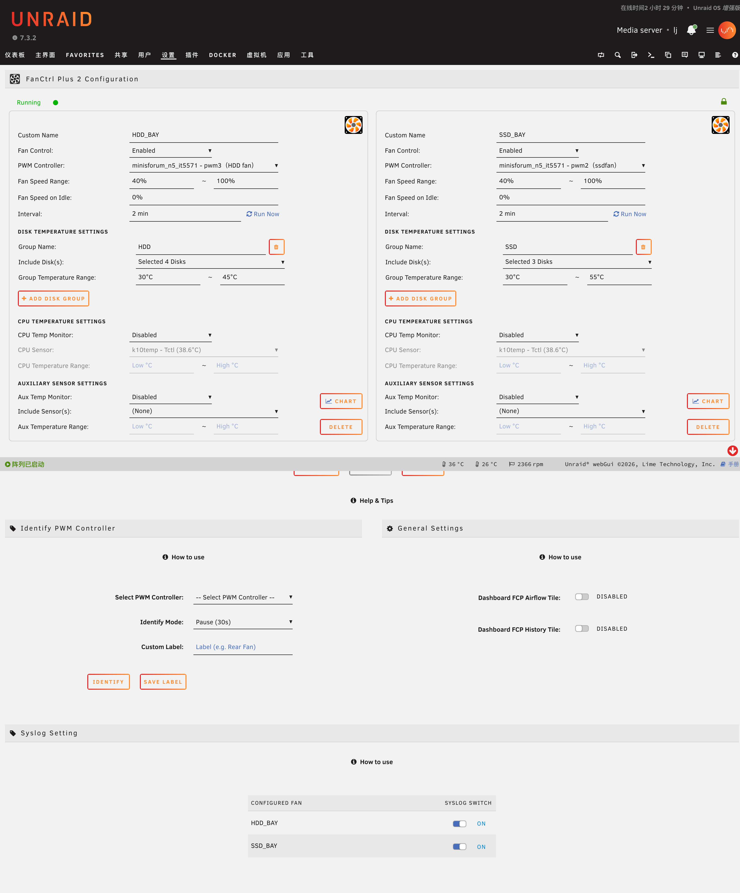

# Minisforum N5 EC / IT5571 Driver for Unraid

<p align="center">
  
</p>


[English](README.md) | 简体中文

`minisforum_n5_it5571` 是面向 Minisforum N5 系列及其 ITE IT5571 EC 的 Linux
hwmon 驱动。N5/F8NAA 已完成实机验证；N5 Pro/F8NAA 与 N5 Air/F8NAB 为实验性配置。

## 功能

- CPU Fan：PWM + RPM。
- SSD Fan：PWM + RPM。
- HDD Fan Group：PWM + RPM。
- PCIe Fan：PWM，无可用 RPM 反馈。
- CPU、System、Board、Ambient 四路温度。
- 推荐搭配 FanCtrl Plus 2，实现多路 PWM 与硬盘、NVMe、CPU、NVIDIA GPU
  等温度源联动。
- 兼容 Dynamix Fan Auto Control。
- 推荐搭配 Dynamix System Temperature，显示 CPU、System、Board、Ambient
  四路 EC 温度。
- 模块卸载或服务停止时恢复 EC/BIOS 自动控制。

## 截图 Screenshots

实机截图（验证环境：Unraid 7.3.2，内核 6.18.38-Unraid）。

**插件状态页** — 四路风扇通道（PWM / 模式 / 转速）与四路 EC 温度：



**Dynamix System Temperature** — 驱动提供的 CPU、主板与阵列风扇传感器：



**FanCtrl Plus 2** — 四区 PWM 控制，绑定驱动的 `pwm1`–`pwm4`：



## 兼容性

| 设备 / DMI 产品名 | 主板 | 状态 | 默认模式 |
|---|---|---|---|
| Minisforum N5 / `N5` | `F8NAA` | 已实机验证（BIOS 1.04） | 开放 PWM |
| Minisforum N5 Pro / `N5 PRO` | `F8NAA` | 实验性 | 只读温度/RPM |
| Minisforum N5 Air / `N5A` 或 `N5 AIR` | `F8NAB` | 实验性 | 只读温度/RPM |

已验证构建环境仍为 Unraid 7.3.2 / `6.18.38-Unraid`。内核模块必须与
`uname -r` 完全匹配；内核升级后需要新的驱动包。

未知的 DMI 产品名/主板组合默认拒绝加载；开发调试可用的 `force=1`
现在也默认只读。

使用同一 IT5571 芯片并不等于自动兼容。不同厂商可能使用不同 PMC 命令、
端口、EC RAM 和风扇接线。目前仍只有 N5/F8NAA 完成完整实机验证；N5 Pro
和 N5 Air 必须逐个物理风扇、逐个通道验证后才能升级为正式支持。

已有一位用户反馈本驱动在 Minisforum MS-A2 上运行良好。这属于社区用户反馈，
并非维护者实机验证。由于尚未收集该机器准确的 DMI 和通道接线，MS-A2 暂不加入
自动白名单；建议反馈者在 GitHub Issue 中补充这些信息后再建立正式配置。

公开资料中采用 IT5571 的其他设备包括
[Avalue EMX-EHLP](https://www.avalue.com/en/product/Industrial-Embedded-Motherboard/Mini-ITX/EMX-EHLP)
工业主板和 [System76 Pangolin（pang13）](https://system76.com/tech-docs/models/pang13/README.html)。
这些型号只是“潜在适配目标”，并非当前受支持设备；请勿绕过 DMI 检查强制加载。

### N5 Pro / N5 Air 实验性测试方法

插件首次加载这两款机型时只显示温度与 RPM，隐藏 PWM 节点。请先确认温度、
转速和 `dmesg` 均合理。确认后如需主动加入 PWM 测试：

```bash
mkdir -p /boot/config/plugins/minisforum-n5-it5571
printf 'EXPERIMENTAL_WRITE=1\n' > /boot/config/plugins/minisforum-n5-it5571/experimental.conf
modprobe -r minisforum_n5_it5571
modprobe minisforum_n5_it5571 experimental_write=1
```

每次只接一个风扇、只测试一个通道；先从全速开始，只做小幅降速，并持续观察
所有温度。不要把 `pwm=0` 作为第一次测试。

## hwmon 通道

| 节点 | 功能 |
|---|---|
| `pwm1`, `fan1_input` | CPU Fan |
| `pwm2`, `fan2_input` | SSD Fan |
| `pwm3`, `fan3_input` | HDD Fan Group |
| `pwm4`, `fan4_input` | PCIe Fan；RPM 固定为 0 |
| `temp1_input` | CPU Temp |
| `temp2_input` | System Temp |
| `temp3_input` | Board Temp |
| `temp4_input` | Ambient Temp |

PCIe Fan 已实机验证能够在 `pwm4=128` 时明显降速、在 `pwm4=0` 时停止，
并能从静止状态通过 `pwm4=255` 可靠起转至全速。重启后四路 PWM 均能恢复
EC 自动模式。
主板固件没有启用或公开可安全使用的 PCIe TACH，因此不会伪造 RPM。

## 安装

### Community Applications

正式收录后，在 Unraid Apps 中搜索：

```text
Minisforum N5 EC / IT5571 Driver
```

### 手动安装插件

在 Unraid 的 **Plugins → Install Plugin** 输入：

```text
https://raw.githubusercontent.com/ltdstudio/minisforum-n5-it5571/main/minisforum-n5-it5571.plg
```

发布者必须为每个支持的 Unraid 内核提供匹配的 release 资产。

## 推荐搭配：Dynamix System Temperature

推荐使用 **Dynamix System Temperature** 作为温度显示层。本驱动负责提供
标准 hwmon 温度节点，Dynamix System Temperature 负责在 Unraid WebGUI 和
Dashboard 中选择并显示温度。

安装后进入：

```text
Settings → System Temperature
```

可用驱动选择 `minisforum_n5_it5571`，然后选择 CPU Temp 和 System Temp。
还可以按需显示 Board Temp 和 Ambient Temp。原先遗留的 `nct6775` 不适用于
本机，应从已选驱动中移除。

推荐分工：

- **Dynamix System Temperature**：温度发现、选择和 Dashboard 展示。
- **FanCtrl Plus 2**：根据温度自动调节四路风扇 PWM。
- **Minisforum N5 EC / IT5571 Driver**：提供底层 PWM、RPM 和 EC 温度节点。

## 推荐搭配：FanCtrl Plus 2

推荐使用社区插件
[FanCtrl Plus 2](https://github.com/andrebrait/fanctrlplus)
作为本驱动的用户态风扇控制层。它能够独立控制多路 PWM，并可读取硬盘、
NVMe、CPU、auxiliary hwmon、StorCLI 和 NVIDIA GPU 温度，适合 N5 的四个
散热区域。

在 Community Applications 中搜索：

```text
FanCtrl Plus 2
```

如果当前 CA feed 尚未显示，可在 **Plugins → Install Plugin** 使用项目提供的
安装地址：

```text
https://raw.githubusercontent.com/andrebrait/fanctrlplus/main/plugin/fanctrlplus2.plg
```

建议映射：

| N5 控制器 | 推荐温度源 |
|---|---|
| CPU Fan / `pwm1` | CPU Temp |
| SSD Fan / `pwm2` | 对应 NVMe 温度组 |
| HDD Fan Group / `pwm3` | 阵列硬盘温度组 |
| PCIe Fan / `pwm4` | NVIDIA GPU 或目标 PCIe 设备的辅助温度 |

本机的 NVIDIA Tesla P4 已验证可由 `nvidia-smi` 读取 GPU 温度，FanCtrl Plus 2
支持 NVIDIA GPU 温度源，因此推荐将 P4 温度绑定到 PCIe Fan。PCIe Fan 没有
RPM 反馈，界面显示 0 RPM 属于正常现象。

FanCtrl Plus 2 与上游 FanCtrl Plus 不能同时运行。也不要让 Dynamix Fan Auto
Control 或其他服务同时控制相同的 `pwmN`，否则多个控制循环会互相覆盖。

### Dynamix Fan Auto Control（备选）

标准 Dynamix Fan Auto Control 仍可识别本驱动的 hwmon PWM；若使用它，必须
先停用 FanCtrl Plus 2，并重新选择 N5 控制器，不能沿用旧 `it87` 路径。

## PCIe 温度源

不同 PCIe 设备的温度传感器不统一。配置时必须选择具体设备与传感器，例如：

- AMD GPU / Edge Temperature / PCI 地址。
- NVIDIA GPU / GPU Temperature / PCI 地址。
- 10GbE NIC / PHY Temperature / PCI 地址。
- NVMe / Composite Temperature / 序列号。

配置 PCIe Fan 前必须确认插座确实连接了风扇，并在 FanCtrl Plus 2 中验证温度
源和 PWM 映射。不同 PCIe 设备不能共用一个固定的温度读取方法。

## 免责声明

本项目为社区爱好者独立开发，**与 Minisforum（铭凡）官方无关，非官方产品，
官方不提供任何支持与质保**。本项目包含未验证因素，按“现状”提供，不作任何
明示或默示担保。**使用即表示您自行承担全部风险。** 因使用本驱动造成的任何
直接或间接损失（包括但不限于硬件损坏、风扇停转过热、数据丢失），作者不承担
任何责任。完整条款见 [DISCLAIMER.md](DISCLAIMER.md)。

目前只有 N5/F8NAA 完成实机验证。N5 Pro/F8NAA 与 N5 Air/F8NAB 属于需要
用户显式确认的实验性配置，不作兼容性保证。

## 安全说明

- **如出现风扇停转、异常全速、控制到错误接口、通道消失或温度异常，立即终止。**
  先停止风扇控制服务并运行 `modprobe -r minisforum_n5_it5571`；如不能卸载，
  立即重启并交还 BIOS 控制。
- 实验性 PWM 测试期间不得无人值守。
- 不要把 `force=1 experimental_write=1` 作为未知主板的普通安装方式。
- 不要安装与当前内核不匹配的 `.ko`。
- 修改 PWM 前确认风扇与散热区域的对应关系。
- 同一个 `pwmN` 只能交给一个风扇控制插件。
- 模块卸载时只恢复本次确实尝试修改过的 PWM 通道。

## 构建

需要与目标 Unraid 内核完全一致的内核源码和 `.config`：

```bash
make -C /path/to/linux M="$PWD" modules
modinfo minisforum_n5_it5571.ko
```

发布前必须确认 `vermagic` 与目标 `uname -r` 完全一致。

## 许可证

驱动源码计划以 GPL-2.0-only 发布。仓库不包含厂商 EC 固件或 IT5571 保密
数据手册。

## 支持

- GitHub Issues: `https://github.com/ltdstudio/minisforum-n5-it5571/issues`
- Unraid Support Thread: `https://github.com/ltdstudio/minisforum-n5-it5571/issues`

提交问题时请附上 Unraid 版本、`uname -r`、BIOS 版本、DMI 主板信息、
`modinfo minisforum_n5_it5571` 和相关 `dmesg` 输出。
